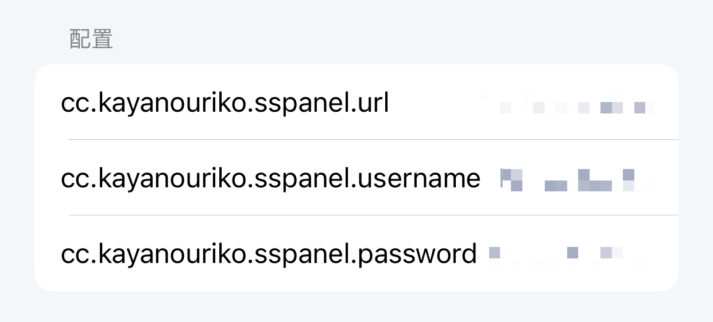

# SSPanel每日签到

使用 SSPanel 管理系统机场的每日签到.  

## 前言

一般使用 SSPanel 管理系统的机场能在控制面板页面最底部能找到 Powered by SSPANEL 的字样.

> [!WARNING]
> 该插件在 Loon 3.1.4(649) 及以上版本才能正常运行

## 更新日志

* v2024.01.13
  1. 初版

## 如何使用

### 首先导入插件

[一键导入插件](https://www.nsloon.com/openloon/import?plugin=https://raw.githubusercontent.com/kayanouriko/Loon-Scripts/main/src/sspanel/sspanel.plugin)

### 插件页面配置参数

|                                                                                              |
| :---------------------------------------------------------------------------------------------------------------------: |
| url 填写机场的网址, 注意无需 `/` 结尾, 例如 https://example.com username 和 password 分别填账号密码 README-01.png |

### 完成

参数填写正确的话, 至此插件可以正常工作了. 

脚本会在每天早上的 6 点整自动签到.
